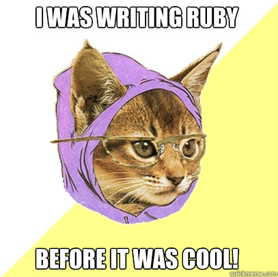
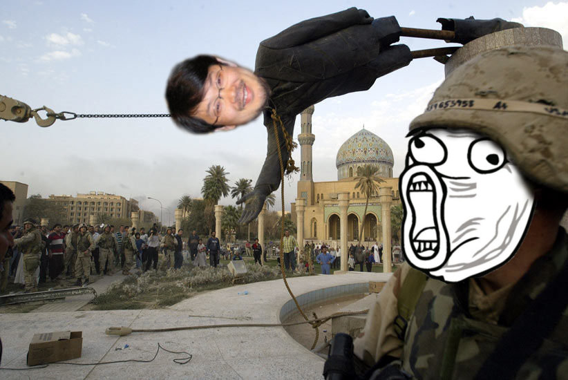
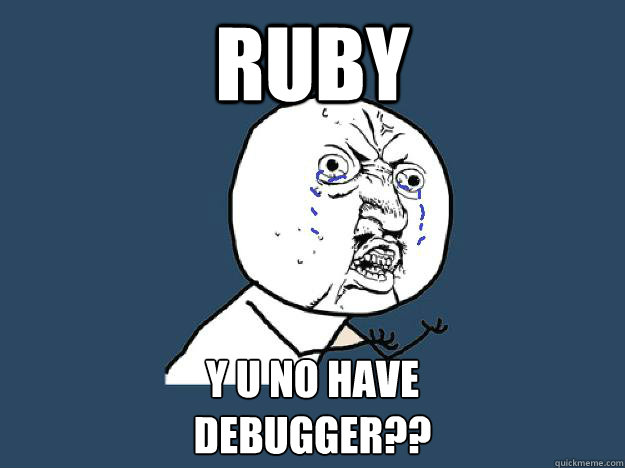
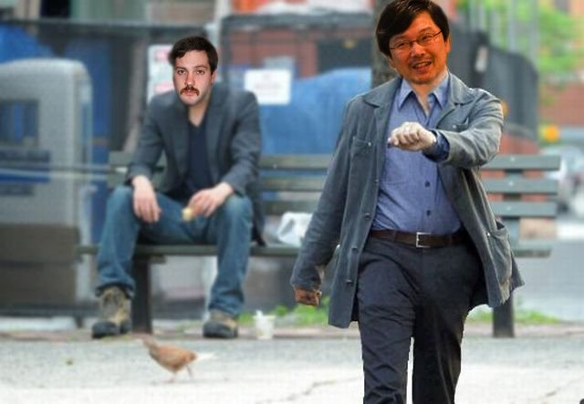
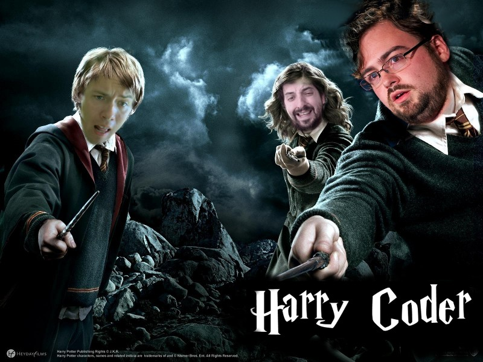
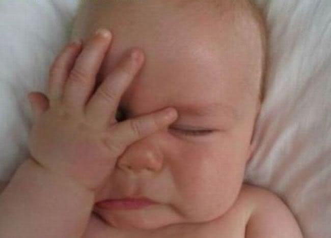

!SLIDE full
# Why?

!SLIDE full wrong
# Everything else sucks!

!SLIDE full wrong
# It't mainstream!

!SLIDE center

!SLIDE full wrong
# Good and bad practices?

!SLIDE with-title

    @@@ruby
	cats.each do |cat|
	  if cat.eating?
	    puts "Om nom nom!"
	  else
	    puts "Meow..."
      end
	end

!SLIDE with-title

    @@@ruby
	cats.each { |cat|
	  if cat.eating?
	    puts "Om nom nom!"
	  else
	    puts "Meow..."
      end
	}

!SLIDE full wrong
# Language

!SLIDE

!SLIDE full wrong
# Tools

!SLIDE 

!SLIDE full wrong
# Roadmap?

!SLIDE

!SLIDE with-title bullets incremental smaller
# Why ruby sucks? (via. Matz)

* Slow
* Complex
* Surprising
* Incosistent
* Bad Embedding
* No Native Thread
* No Multilingualization

!SLIDE full wrong
# Mindset...

!SLIDE

!SLIDE full wrong
# Rails developers

!SLIDE

!SLIDE with-title

    @@@ruby
    module Spells
	  %w(abra kadabra).each do |name|
	    define_method(name) do
		  name
		end
	  end
	end

    module Magician
	  include Spells
	end

!SLIDE

!SLIDE

